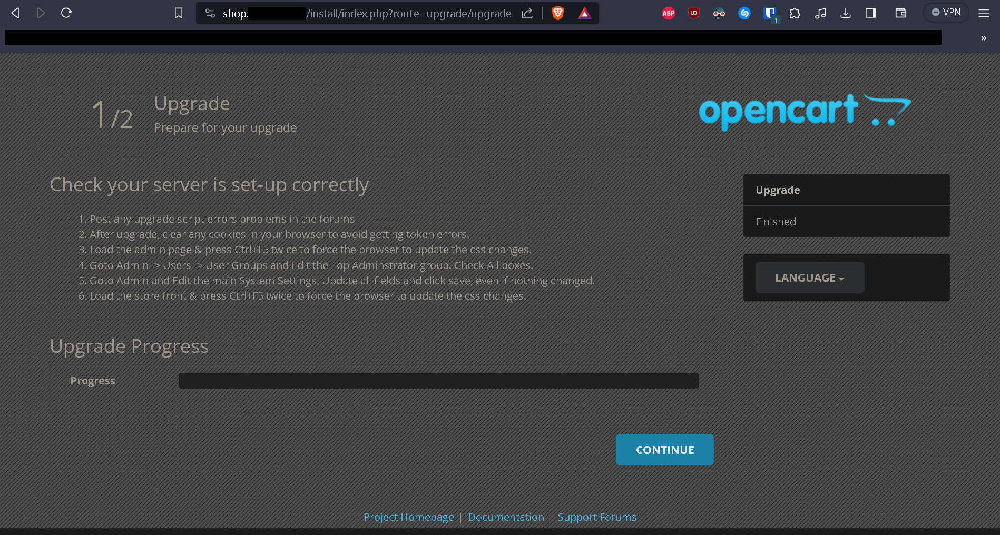
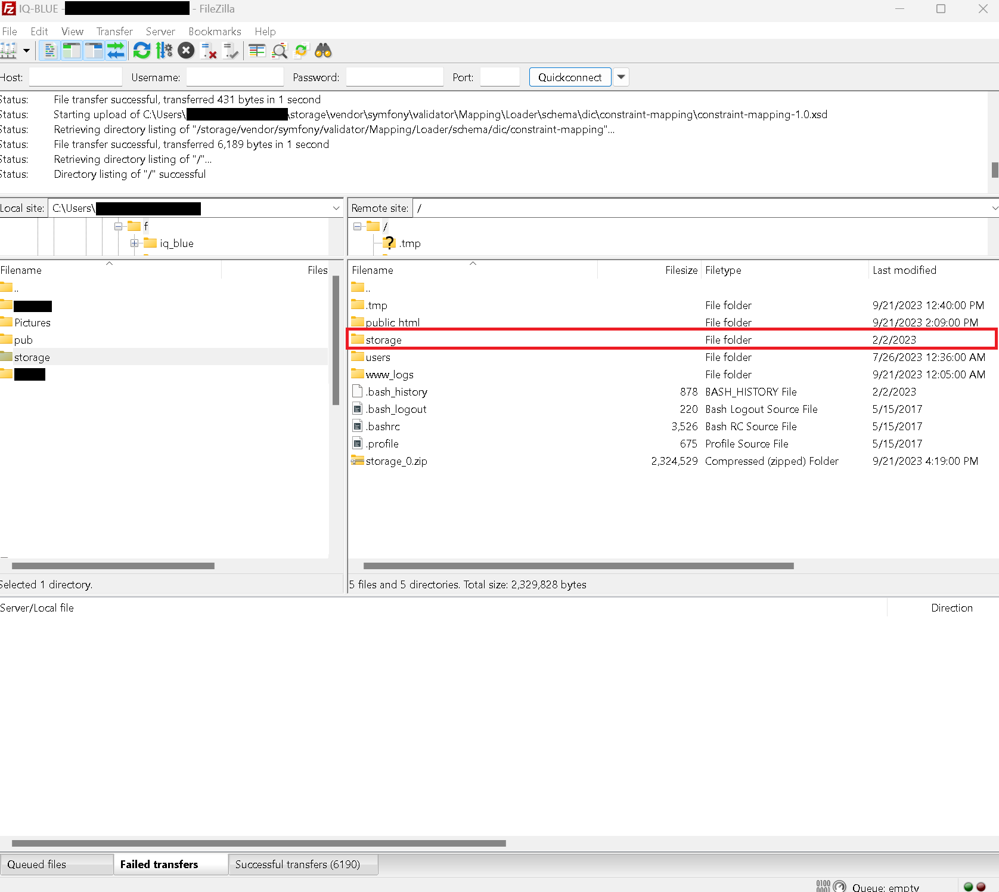
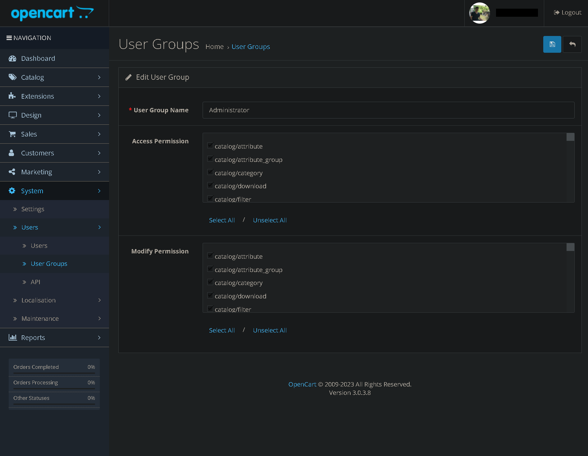
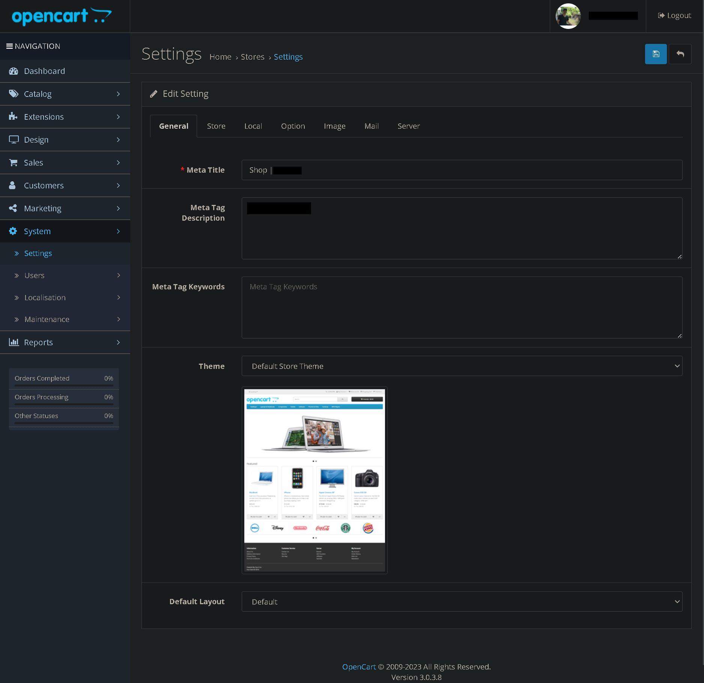

# OpenCart Upgrading Maintenance Branch South Africa Xneelo Shared Hosting

Below is how I was able to upgrade my distribution of **OpenCart 3.0.3.8** with the **3.0.x.x_Maintenance** branch.

### Step 1

Login to your existing distribution of **OpenCart 3.0.3.8**

Go to *System > Maintenance > Backup/Restore*

Now export a backup of your SQL data.

### Step 2

Login via FTP now zip and download a backup of all your shop files.

### Step 3

Download the latest Maintenance files from github.

https://github.com/opencart/opencart/tree/3.0.x.x_Maintenance

### Step 4

Upload all new files on top of your current install except your config.php and admin/config.php.

### Step 5

Browse to `http://<yourstore.com>/install` Replacing `<yourstore.com>` with your actual site (and subdirectory if applicable).

Click "Upgrade". After a few seconds you should see the upgrade success page.

### Step 6

Special storage folder copy (in the case of clients with shared hosting)

Copy the `/public_html/<yourstore.com>/system/storage` folder to `/storage` in Filezilla

### Step 7

Clear any cookies in your browser

Goto the admin side of your store and press Ctrl+F5 or Ctrl+Shift+R for several times to refresh your browser cache. 

That will prevent oddly shifted elements due to stylesheet changes. Login to your admin as the main administrator.

### Step 8

Login to your admin panel and go to *System > Users > User Groups*

Edit the Administrator select all permissions and save (even if nothing changed)

Go to *System > Settings* edit the store and save.

Also refresh the theme.

- Links
    - https://github.com/opencart/opencart/tree/3.0.x.x_Maintenance

